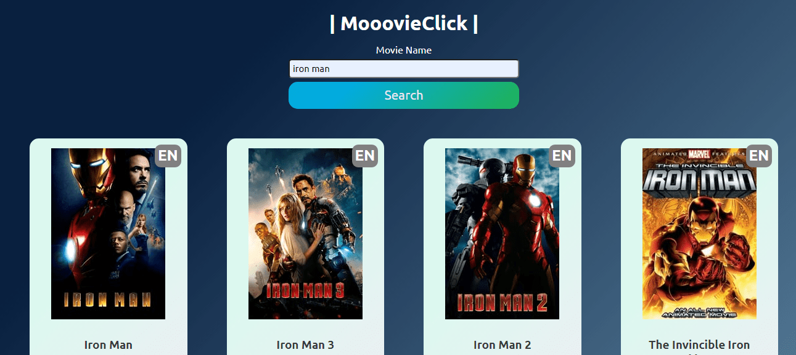

# | mooovieClick | - A tiny React based movie searching app.

## Top 2 things I learned : 
* How to fetch an API in React
* How to use React Hooks (Been a class component fan, but React Hooks is amazing)

### Go on and search for some movies:  https://mooovieclick.netlify.app 

### Created with CodeSandbox
